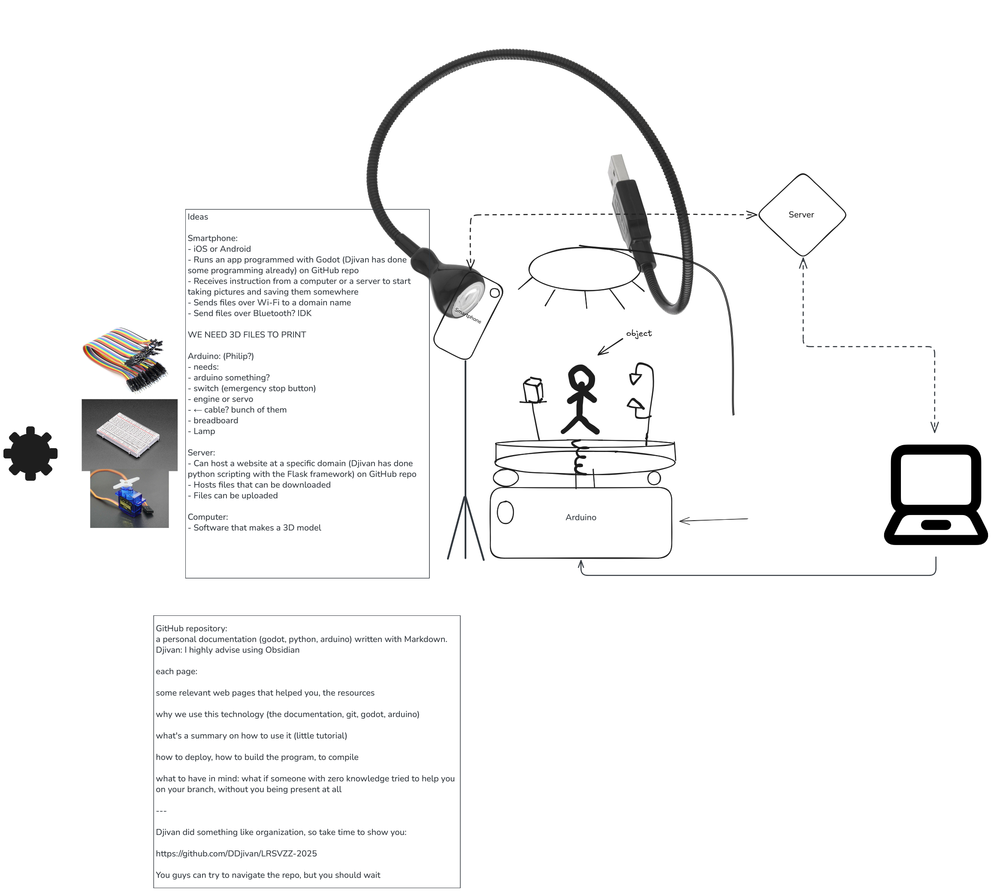
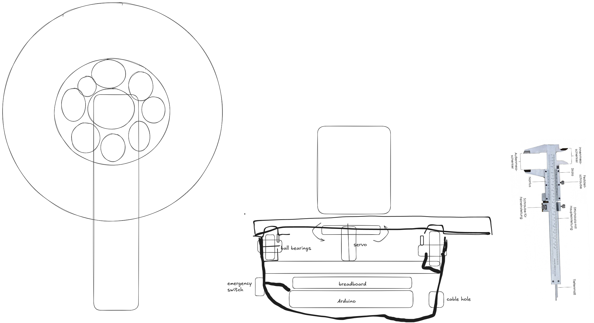

2025-10-01
Djivan Vartanian, Andrei Stupu and Philip Schlicht

# TASK:
**Homework:** Prepare a detailed, per-person task plan describing what each team member will work on in the course of the next two TP sessions. This has to be posted on your team Discord channel before 2025-10-02.

# We need to Decide on Quaterdeadlines!

### Camera programming (App)
- Framwork
- Design UI
- Take Fotos
- compare a way to send Fotos
- distribute the app on multible devices (Andorid, IOS, Linux )
- Test on Multiple Devices which have a cammera

## Embedded programming
 - Compare Technologies and decide
 - Get the servo to spin
 - connect arduino to engine
 - is arduino the best choice? What microcontroller to use?

## Design
 - Messure the Arduino and the Ballbearings
 - Which CAD Software
 - Which Fillerment
 - Which Printer and Sclicer
 - [How will it look (10 Thesis (rams))](https://rams-foundation.org/foundation/design-comprehension/theses/)

## Project Organisation
- Use GIT
- Organize Files
- write documentation
- https://github.com/DDjivan/photo-turntable-project
- search, summarize and compare existing projects that are similar to parts of our projects

# Members

Djivan (INF @ ESIEE)
- likes python, C, C++, GD-script
- hates java script (and Matlab)
- has used: Blender, Godot and FreeCAD
- maybe leads camera development
- is Curious about Design and microcontrollers

Andrei (Computer Science(italy) / AIC @ ESIEE )
- likes C, Java
- knows hove to treat memory leaks (and hates garbage collectors)
- studied data base and sql, structured database logic for a project
- knows about modularity and IPC communication
- is a GCC enjoyer
- accomplish some Assembly in RISC-V
- interesseted in Design and 3D-printing

Philip (Mechenical Engineering - Product development (germany) / SEI @ ESIEE)
- learned Java
- used CAD (Creo parametic)
- 3D printed a some times
- had some Arduino projects
- did some Design
- (can calculate forces of steel and do flow Simulation)
## Brainstorm from 2025-09-26 on excalidraw.com
