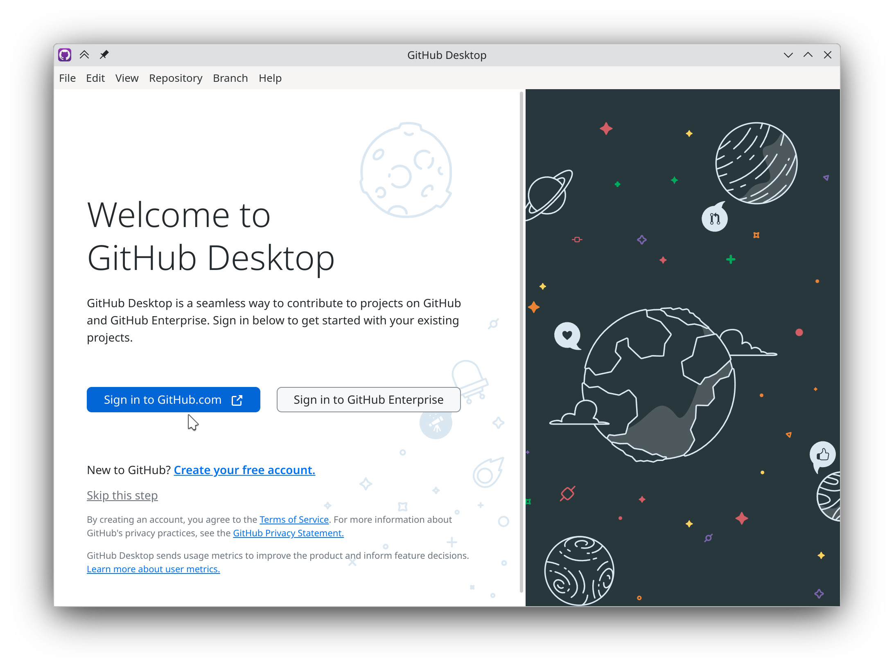
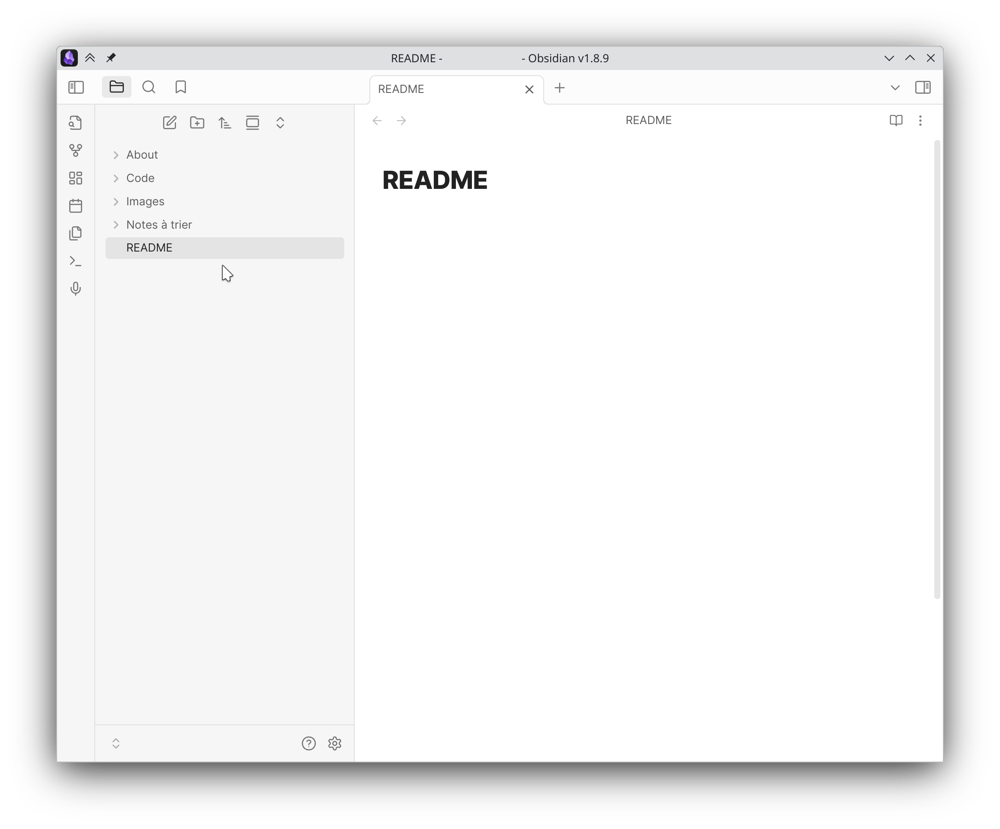

Imported from one of [Djivan](../People/VARTANIAN%20Djivan.md)'s previous projects. 

# Guide pour accéder au projet 
Un compte [GitHub](GitHub.md) est nécessaire : https://github.com/login. 
Deux outils nécessaires expliqués ci-dessous : [GitHub Desktop](GitHub%20Desktop.md) et [Obsidian](Obsidian.md). 

## 1. Téléchargements et installation 
### Linux 
GitHub Desktop : 

 

Obsidian : 

 
### Windows 
GitHub Desktop : 

 

Obsidian : 

 

---

## 2. Configuration [GitHub Desktop](GitHub%20Desktop.md) 
### Connexion 
Se connecter avec son compte GitHub en cliquant sur le bouton principal "Sign in". 

### Paramètres de connexion 
Finaliser sa connexion en cliquant sur le bouton principal "Finish". 

 

### Importation 
Importer le projet en le sélectionnant à gauche. 
Le repository s'appelle "DDjivan/LRSVZZ-2025". 
Cliquer sur le bouton principal "Clone". 

> [!info] Information
> Si le repository n'apparaît pas dans la liste, s'assurer que le compte fait partie des membres du repository. Le propriétaire de ce dernier étant [VARTANIAN Djivan](../People/VARTANIAN%20Djivan.md), ne pas hésiter à le contacter.

 

### Paramètres d'importation  
Sélectionner le répertoire "Local path" en cliquant sur le bouton "Choose". 

> [!tip] Conseil 
> Naviguer dans le dossier "Documents", et y créer un dossier "Git". 

> [!info] Information
> Ce répertoire n'a pas à être enregistré dans un cloud. 
 
Après avoir sélectionné, cliquer sur le bouton principal "Clone". 

### Finalisation 
Si le dossier sélectionné est valide, une fenêtre devrait indiquer la progression de téléchargements de tous les fichiers, qui résulterait en la fenêtre suivante. 

Le logiciel peut être à présent minimisé, voire fermé. 

 

---

## 3. Configuration Obsidian 
### Ouverture initiale 
Sélectionner le bouton "Open", et sélectionner le répertoire du repository, "LeMajordome", ce qui permet de créer un *vault*. 

S'il est situé comme proposé dans le guide, il devrait se situer à la racine de l'utilisateur : `Documents > Git > LRSVZZ-2025`. 

### Confirmation  
Il est possible que le *vault* contienne des fonctionnalités de tierce partie (des *plugins*). 
Afin qu'ils restent activés, il faut sélectionner "Trust author and enable plugins". 

> [!info] Information 
> À ce jour (2025-05-20), le *vault* peut être ouvert sans les *plugins* sans aucun problème. Il suffit d'appuyer sur le bouton "Browse vault in Restricted Mode". 

 

### Finalisation 
Le *vault* est prêt, la lecture (voire l'écriture) peut maintenant commencer. 

 

---

## 4. Lire 
De nombreuses notes ont été rédigées pour comprendre le projet. 

Commencer à partir du fichier initial [README](../../README.md) afin de commencer la lecture de l'ensemble de la documentation. 

À présent, le plus important est de comprendre en détail [GitHub Desktop](GitHub%20Desktop.md), puis [Obsidian](Obsidian.md). 

Merci pour votre lecture, et bon courage ! 

---

## À propos 
Guide rédigé par [VARTANIAN Djivan](../People/VARTANIAN%20Djivan.md). 
Dernière mise à jour : 2025-06-04 09:07 

